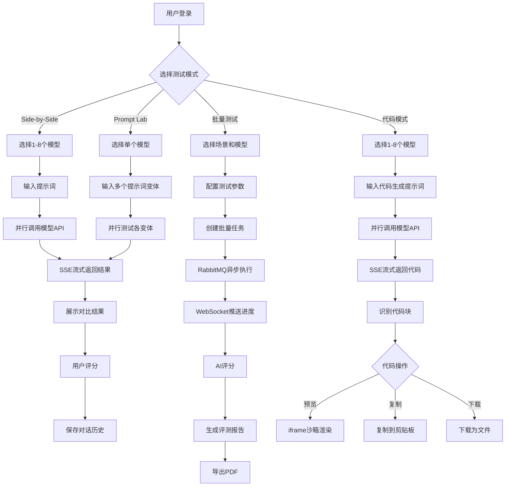

# AI 大模型评测平台

> 作者：[编程导航学习圈](https://codefather.cn)

## 一、项目介绍
这是一套以 **AI 应用开发实战 + 后端架构设计** 为核心的项目教程，基于 Spring Boot 3.5 + Spring AI + Vue 3 开发的 **企业级 AI 大模型评测平台**，帮助用户快速对比多个大模型、优化提示词策略，并生成专业的评测报告。

通过这个项目，你将掌握当下最热门的 AI 应用开发技术，包括 OpenRouter 多模型集成、SSE 流式响应、场景化批量测试、AI 评分系统等，大幅提升求职竞争力。

除了 Java 主版本外，项目还提供了 **Go 版本**（Gin + LangChainGo）和 **Python 版本**（FastAPI + LangChain），三套后端共用同一套前端，方便不同技术栈的同学学习。每个版本都有独立的简历写法和面试题解，直接写满你的简历。

平台一共有 8 大核心能力，我们逐个来看。

### 8 大核心能力
1）多模型并排对比（Side-by-Side）

选择 1-8 个大模型，输入同一个提示词，并排实时流式展示各模型的回答，直观对比响应速度、Token 消耗和成本。

2）Prompt Lab 提示词实验

选择单个模型，输入 2-5 个提示词变体，对比不同提示词策略（直接提问、思维链、角色扮演等）的效果，帮助优化提示词。

3）Battle 匿名对战模式

隐藏模型名称和图标，以匿名方式（模型 A、模型 B）对比两个大模型的回答，用户根据回答质量评分后再揭晓真实身份，消除品牌偏见，让评测回归本质。

4）场景化批量测试

基于预设场景（编程能力、数学推理、文案创作等）自动化批量测试，使用 RabbitMQ 任务队列异步执行，实时推送测试进度。

5）可视化评测报告

使用 ECharts 生成多维度对比图表（雷达图、柱状图），支持 AI 自动评分和 PDF 导出，为模型选型提供数据支撑。

6）代码沙箱预览

自动识别 AI 生成的 HTML/CSS/JS 代码，在安全的 iframe 沙箱中实时预览网页效果，类似 ChatGPT 的代码展示体验。

7）成本实时监控和预警

用户在测试过程中可以实时查看消耗成本，当消耗达到预算阈值时自动预警，还提供成本统计仪表盘，帮你优化模型选择。

8）多模态输入支持

支持上传图片和文本组合输入，对比不同模型的图片理解能力；支持联网搜索获取实时信息；支持调用图像生成模型，全方位评测大模型的多模态能力。

当你学会这个项目后，不仅能开发 AI 模型评测工具，更能灵活开发各种 AI 对比分析应用：AI 写作助手对比、智能客服测评、代码生成器评测等，尽情发挥自己的想象力。

### 为什么做这个项目
说到为什么选这个方向，主要有三点考虑。

+ 市场需求大。大模型越来越多，用户在选型时面临困难。不同模型在不同领域的表现差异大，但缺少简单易用的对比测试工具。
+ 找工作好用。AI 大模型应用开发是当下最热门的技术方向，掌握 Spring AI、SSE 流式响应、多模型集成等技术的程序员在求职时很有优势。
+ 技术值得学。这个项目涵盖了 AI 应用开发的核心技术栈，包括 OpenRouter 统一网关、Flux.merge() 响应式并行编程、RabbitMQ 消息队列、ECharts 可视化等企业级技术。

已经有不少编程导航的鱼友通过我们的 AI 项目斩获了大厂 offer，来看看他们的战果：

## 二、项目优势
### 项目收获
本项目紧跟 AI 时代、选题新颖，对标大厂产品（如 LMArena、OpenCompass），技术丰富。区别于增删改查的烂大街项目，鱼皮会带你实战大量新技术和企业应用场景，帮你成为 AI 时代企业的香饽饽，给简历和求职大幅增加竞争力。

全栈 AI 项目，技术丰富，玩透 Spring AI：

业务场景真实，实践大量企业解决方案：

+ OpenRouter 统一集成 100+ 模型
+ 多模型并行对比（响应速度提升 4 倍）
+ SSE 流式响应 + 实时 Token 计数
+ 场景化批量测试 + 异步任务队列
+ 多评委 AI 交叉评分
+ 可视化报告 + PDF 导出
+ 代码沙箱安全预览
+ 成本实时监控和限流保护

鱼皮给大家讲的是通用的项目开发方法、企业级架构设计套路和最新的 AI 应用开发技术，通过这个项目你可以学到：

+ 如何基于 Spring AI 构建 AI 应用，实现多模型统一调用？
+ 如何使用 OpenRouter 一个 Key 接入 100+ 大模型？
+ 如何实现 SSE 流式响应 + 打字机效果，提升用户体验？
+ 如何使用 Flux.merge() 响应式并行调用多模型，性能提升 4 倍？
+ 如何设计场景化批量测试系统，支持大规模自动化评测？
+ 如何使用 RabbitMQ + WebSocket 实现异步任务和进度推送？
+ 如何用 AI 评委给 AI 回答打分，实现交叉验证？
+ 如何使用 ECharts 生成多维度可视化报告？
+ 如何实现代码沙箱安全预览，防止 XSS 攻击？
+ 如何从性能、安全性、成本等角度全方位优化项目？

此外，还能学会很多 AI 编程、系统架构设计、技术方案对比的方法，提升排查问题、自主解决 Bug 的能力。鱼皮还给大家提供了大量的项目扩展点，有能力的同学可以进一步拉开跟别人的区分度，无限进步。

### 鱼皮系列项目优势
鱼皮原创项目系列以实战为主，用全程直播的方式，从 0 到 1 带大家学习技术知识，并立即实践运用到项目中，做到学以致用。

此外，还提供如下服务：

+ 详细的文字教程或直播笔记
+ 完整的项目源码
+ 1 对 1 答疑解惑
+ 专属项目交流群
+ 现成的简历写法（直接写满简历）
+ 项目的扩展思路（拉开和其他人的差距）
+ 项目相关面试题、题解和真实面经（提前准备，面试不懵逼）
+ 前端 + Java 后端万用项目模板（快速创建项目）

比起看网上的教程学习，鱼皮项目系列的优势：从学知识 => 实践项目 => 复习笔记 => 项目答疑 => 简历写法 => 面试题解的一条龙服务。

| 对比维度 | 跟学鱼皮项目 | 自学网上免费项目 | 鱼皮项目优势 |
| --- | --- | --- | --- |
| 项目选题 | 选题新颖，刻意避开网上热门项目 | 传统项目场景（博客、商城、管理系统） | 增加区分度，提高简历通过率 |
| 学习人数 | 少，不容易撞车 | 百万以上，烂大街 | 增加区分度，提高简历通过率 |
| 教学方式 | 全程直播，带你敲每一行代码、带你踩坑和解决 Bug | 录制课程，遇到错误无从下手 | 降低学习门槛，减少学习时长 |
| 直播笔记 | 详细的官方笔记 + 精选学员优质笔记 | 有笔记，但未经筛选 | 学到更多知识细节 |
| 项目源码 | 完整源码仓库 + 每章的提交记录 + 定期更新 | 只有代码包、不更新 | 节省时间，避免踩坑 |
| 项目答疑 | 各项目交流群 + 答疑解惑 + 常见问题整理 | 无免费的答疑服务 | 节省时间 |
| 简历写法 | 现成的简历写法 | 无 | 节省时间、提高简历通过率 |
| 项目面试 | 项目相关面试题、题解和真实面经 | 无 | 提前准备，面试不懵逼 |

编程导航已有 20+ 套项目教程，每个项目的学习重点不同，几乎全都是前端 + 后端的全栈项目。

详细请见：[https://codefather.cn/course](https://www.codefather.cn/course)

## 三、业务流程
先来看看平台的核心业务流程，从用户登录、选择模型，到对比测试、查看报告，整个链路是这样的：

简单来说，Side-by-Side 和 Prompt Lab 走的是实时对比路线，选模型、输入问题、流式展示、用户评分、保存对话；批量测试走的是异步任务路线，创建任务、RabbitMQ 异步执行、AI 自动评分、生成报告、导出 PDF。每个环节背后都有对应的技术方案支撑，后面会逐一展开讲。

### 解决方案实战

AI 技术实战：

+ Spring AI 多模型集成
+ OpenRouter 统一网关（100+ 模型一键接入）
+ SSE 流式响应（打字机效果）
+ Flux.merge() 响应式并行编程（多模型并行调用）
+ AI 结构化输出（评分结果自动解析）
+ AI 多评委交叉验证
+ 提示词工程优化（CoT、角色扮演、Few-shot）
+ Token 实时计数和成本追踪

系统架构设计：

+ 前后端分离 + 模块化单体架构
+ Redis + Caffeine 多层缓存策略
+ RabbitMQ 异步任务队列
+ WebSocket 实时进度推送
+ ECharts 数据可视化
+ 响应式编程（WebFlux）

经典业务：

+ 多模型统一调用和切换
+ 场景化批量测试和任务管理
+ 多维度可视化报告生成
+ 代码沙箱安全预览
+ PDF 报告导出
+ 对话历史和上下文管理
+ 模型用量统计分析

安全和性能：

+ Spring Session + Redis 分布式会话
+ Redisson RRateLimiter 限流保护
+ Prompt 安全审查和护轨
+ XSS 防护（OWASP Sanitizer）
+ 成本预算预警机制
+ 数据库索引优化

## 四、功能模块
平台一共包含以下几大功能模块，我们来逐一梳理：

**用户模块**

+ 用户注册
+ 用户登录
+ 用户注销
+ 获取当前登录用户信息
+ 用户权限控制

**多模型对比模块**

+ Side-by-Side 并排对比（1-8 个模型）
+ SSE 流式响应（打字机效果）
+ 实时 Token 统计
+ 实时成本计算
+ 多轮对话支持
+ 对话历史保存

**Prompt Lab 模块**

+ 单模型多提示词对比（2-5 个变体）
+ 提示词模板库（CoT、角色扮演、Few-shot 等）
+ 效果对比分析
+ 最佳提示词推荐
+ ⭐️ AI 提示词优化建议

**代码沙箱模块**

+ 代码块自动识别
+ Monaco Editor 语法高亮
+ ⭐️ iframe 沙箱安全预览
+ XSS 防护
+ 代码复制/下载

**批量测试模块**

+ 场景管理（预设/自定义）
+ 场景提示词管理
+ ⭐️ RabbitMQ 任务队列
+ 异步并发执行
+ WebSocket 进度推送
+ 测试结果汇总

**可视化报告模块**

+ 数据统计分析
+ ⭐️ ECharts 图表展示
+ 雷达图（多维能力对比）
+ 柱状图（性能对比）
+ PDF 导出

**AI 评分模块**

+ ⭐️ 多评委交叉验证
+ 结构化评分输出
+ 多维度评价（准确性、完整性、清晰度等）
+ 评分结果存储

**Battle 匿名对战模块**

+ 匿名模型对比
+ 结果揭晓

**系统优化**

+ ⭐️ Redis 缓存优化
+ 数据库索引优化
+ Redisson 限流保护
+ Prompt 安全审查
+ AI 调用重试策略
+ 前端代码分割

## 五、技术选型
了解完功能模块，再来看看支撑这些功能背后的技术选型，整体技术栈如下图所示：

### 后端
核心框架：

+ Spring Boot 3.5.9 框架
+ Java 21
+ MyBatis-Flex 数据访问

AI 技术：

+ ⭐️ Spring AI 1.1+ 框架
+ ⭐️ OpenRouter 统一网关（100+ 模型）
+ ⭐️ AI 流式输出
+ ⭐️ 模型对比
+ ⭐️ 模型测试
+ 提示词实验
+ 文生图
+ 图生图
+ 图片理解
+ 联网搜索
+ OpenAI / DeepSeek / Qwen

架构设计：

+ 前后端分离
+ 模块化单体
+ 分层架构
+ ⭐️ WebFlux + SSE
+ WebSocket 进度推送
+ ⭐️ 异步任务队列

数据存储：

+ MySQL 8.0+ 数据库
+ ⭐️ Redis 7.x 分布式缓存
+ COS 对象存储

缓存 & 会话：

+ Spring Session 会话管理
+ ⭐️ Redisson 限流/分布式锁

消息队列：

+ ⭐️ RabbitMQ 3.12+ 任务队列

工具库：

+ Lombok 注解库
+ Knife4j + Swagger API 文档
+ Hutool 工具库

### 前端
核心框架：

+ ⭐️ Vue 3.x + Composition API
+ ⭐️ TypeScript 5.8.0
+ ⭐️ Vite 7.0.0 构建工具

UI & 状态：

+ Ant Design Vue 组件库
+ Pinia 状态管理

路由 & 请求：

+ Vue Router 路由
+ Axios HTTP 客户端

可视化 & 编辑：

+ ⭐️ ECharts 5.x 图表库
+ ⭐️ Monaco Editor 代码编辑器

工具 & 通信：

+ markdown-it 渲染
+ @stomp/stompjs WebSocket

### 部署运维
+ Docker 容器化
+ Nginx

### 多语言版本对比

| 对比维度 | Java 版 | Go 版 | Python 版 |
|---------|---------|-------|-----------|
| **核心框架** | Spring Boot 3.5.9 | Gin | FastAPI |
| **AI 框架** | Spring AI 1.1+ | LangChain-Go | LangChain |
| **并发模型** | WebFlux + Flux.merge() | Goroutine + Channel | asyncio + gather() |
| **数据库 ORM** | MyBatis-Flex | GORM | SQLAlchemy 2.0 |
| **会话管理** | Spring Session + Redis | 自定义 Redis Session | 自定义 Redis Session |
| **限流方案** | Redisson RRateLimiter | Redis Lua 脚本 | Redis 装饰器 |
| **任务队列** | RabbitMQ | RabbitMQ | 线程池 (asyncio.to_thread) |
| **部署方式** | JAR 包 | 单二进制文件 | Python 运行时 |
| **镜像大小** | ~300MB | ~20MB | ~200MB |
| **启动速度** | 5-15 秒 | 秒级 | 秒级 |

**版本选择建议**：

- 如果你 **Java 背景**，推荐学习 Java 版，Spring 生态完善，企业级应用开发首选
- 如果你追求 **高并发、低延迟**，推荐学习 Go 版，Goroutine 轻量级并发，部署极简
- 如果你 **Python 背景**，推荐学习 Python 版，AI 生态丰富，开发效率极高

无论选择哪个版本，都能学到完整的 AI 应用开发流程和 企业级架构设计能力。

## 六、架构设计
从客户端发送请求开始，自上而下经过一系列处理，最终得到响应结果。架构图如下：

## 七、准备工作
### AI 基础知识
请先观看《程序员鱼皮 AI 指南》，了解 AI 基础知识和学习路线，后续在项目中实战时会有个大致的印象，便于学习理解。

推荐观看视频版：[https://www.bilibili.com/video/BV1i9Z8YhEja](https://www.bilibili.com/video/BV1i9Z8YhEja/)

文字版：[https://www.codefather.cn/course/1907378983347892226](https://www.codefather.cn/course/1907378983347892226)

如果项目经验不多、或者自主学习能力一般，建议学这个项目前，先学习鱼皮的 [AI 超级智能体项目](https://www.codefather.cn/course/1915010091721236482)，这样学这个项目时会更加轻松。

### 工具资源
本项目主要使用以下开发工具：

+ 后端开发：IntelliJ IDEA（推荐 2024.x 版本）
+ 前端开发：VS Code 或 Cursor
+ 数据库管理：DataGrip 或 Navicat
+ API 测试：Postman 或 Knife4j 在线文档

建议准备一款 AI 开发工具或插件辅助开发，首推 Cursor 和 Claude Code。
